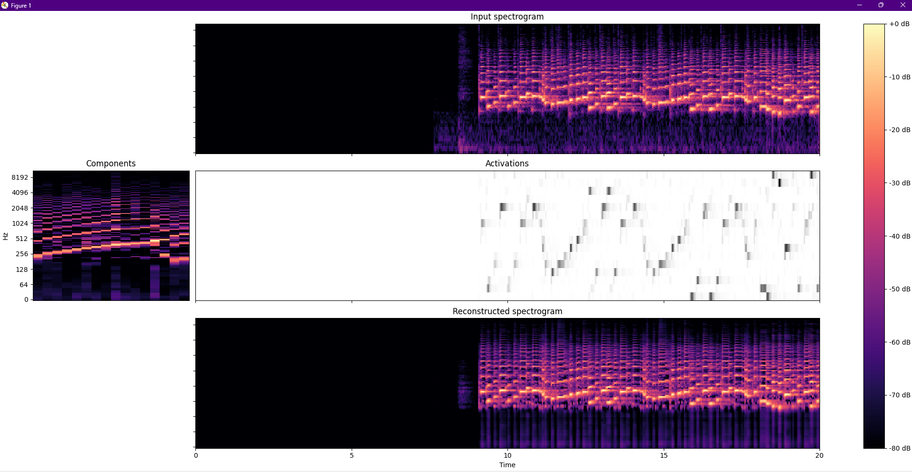
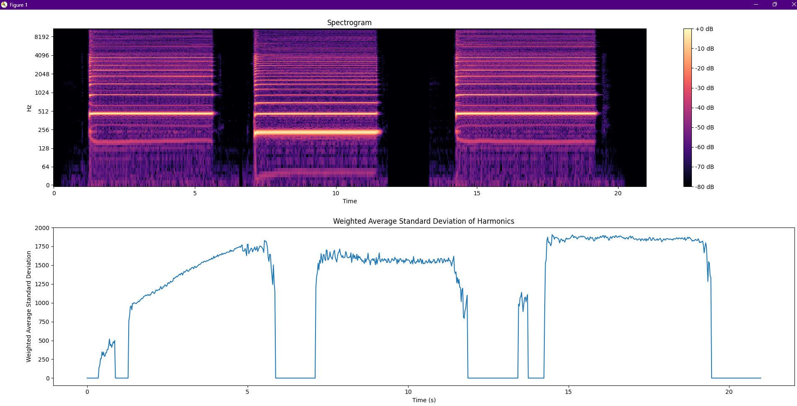

# XTR
The XTR the "Xander Tone Rating" based off of the standard deviation of the overtone series of a note being played.
There are three different specifications within the rating:
- Depth of Sound
  - Determined by the standard deviation of the overtone series
- Brightness of Sound
  - Determined by the average standard deviations of the overtone series with weights on the louder overtones.
- Envelope of Sound
  - Determined by the standard deviation of the derivative (or second derivative) of the graph of a bezier curve plotted
    onto the overtone series
## Developer Log
### Entry 1: December 14, 2024
The figure below is a spectrogram of a saxophone recording being played. Below the initial spectrogram, you can see the
notes detected at that specific time. I am going to add three more graphs that show the three specifications of Tone
Rating.

### Entry 2: December 16th
The figure below is a spectrogram of a Saxophone being played with a relatively low tone quality. Below the spectrogram
is the graph of the weighted Average Standard Deviation of the harmonics of the prime (octave) note. This value is a
possible way to determine the tonality of a player in respect to the intonation of their overtones.
> Note: Further research on this value will be shown below Figure 1

